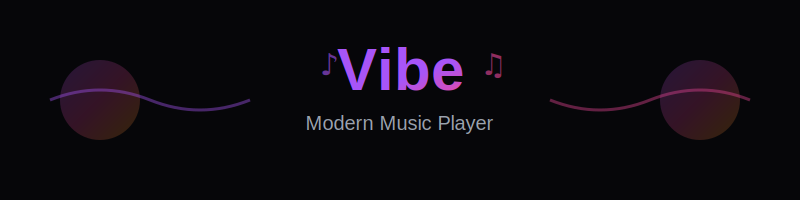
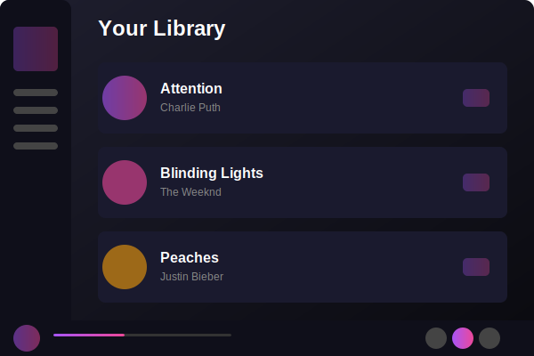
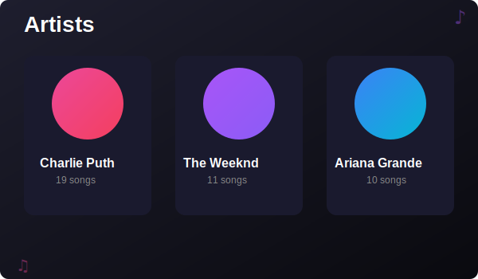
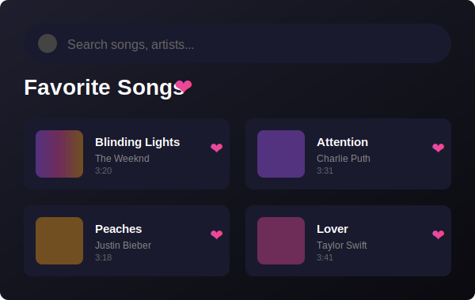

<div align="center">
  
  
  <p align="center">
    <strong>A beautiful, feature-rich music player built with React</strong>
  </p>
  
  <p align="center">
    <a href="https://kishore-donipudi.github.io/Vibe">🌐 Live Demo</a> •
    <a href="#features">✨ Features</a> •
    <a href="#installation">📦 Installation</a> •
    <a href="#usage">🚀 Usage</a>
  </p>
  
  <p align="center">
    
    
    
    
  </p>
</div>

---

## 📖 About

**Vibe** is a modern, sleek music player web application that brings your favorite songs to life. Built with React and styled with Tailwind CSS, it offers an intuitive and responsive interface for managing and enjoying your music collection.

## ✨ Features

### 🎼 Core Features
- **🎧 Seamless Playback** - Smooth audio playback with play, pause, skip, and seek controls
- **🔀 Queue Management** - Add songs to queue, shuffle, and control playback order
- **🔁 Repeat Modes** - Support for repeat one, repeat all, and no repeat
- **📱 Responsive Design** - Optimized for desktop, tablet, and mobile devices
- **🎨 Beautiful UI** - Modern, gradient-based design with smooth animations

### 🎯 Advanced Features
- **👤 User Authentication** - Login and signup functionality with profile management
- **❤️ Favorites** - Mark your favorite songs and access them quickly
- **🔍 Smart Search** - Powerful search to find songs, artists, and albums instantly
- **👨‍🎤 Artist Pages** - Browse music organized by artists
- **📜 Recently Played** - Keep track of your listening history
- **🎵 All Songs View** - Browse your complete music library
- **🌈 Artist Color Themes** - Each artist has a unique color scheme

### 🎛️ Player Controls
- Volume control with mute option
- Progress bar with seek functionality
- Next/Previous track navigation
- Current song info display with artist and title

## 🚀 Demo

Visit the live application: [Vibe Music Player](https://kishore-donipudi.github.io/Vibe)

### 📸 Screenshots

<div align="center">
  
  <p><em>Clean and modern music player interface with intuitive controls</em></p>
</div>

<div align="center">
  <table>
    <tr>
      <td width="50%">
        
        <p align="center"><em>Browse your favorite artists</em></p>
      </td>
      <td width="50%">
        
        <p align="center"><em>Quick access to your favorite songs</em></p>
      </td>
    </tr>
  </table>
</div>

## 📦 Installation

### Prerequisites
- Node.js (v16 or higher)
- npm or yarn

### Steps

1. **Clone the repository**
   ```bash
   git clone https://github.com/Kishore-donipudi/Vibe.git
   cd Vibe
   ```

2. **Install dependencies**
   ```bash
   npm install
   ```

3. **Start the development server**
   ```bash
   npm run dev
   ```

4. **Open your browser**
   Navigate to `http://localhost:5173`

## 🎮 Usage

### Development
```bash
npm run dev        # Start development server
npm run build      # Build for production
npm run preview    # Preview production build
npm run lint       # Run ESLint
```

### Deployment
```bash
npm run deploy     # Deploy to GitHub Pages
```

## 🛠️ Tech Stack

| Technology | Purpose |
|-----------|---------|
| **React 19.2** | Frontend framework for building the UI |
| **React Router DOM** | Client-side routing and navigation |
| **Vite** | Fast build tool and dev server |
| **Tailwind CSS** | Utility-first CSS framework for styling |
| **React Icons** | Icon library for UI elements |
| **Context API** | State management for music and auth |

## 📂 Project Structure

```
Vibe/
├── public/                 # Static assets
│   ├── favicon.png        # App icon
│   └── Laughing_cat.jpeg  # Sample image
├── src/
│   ├── components/        # Reusable UI components
│   │   ├── Navbar.jsx    
│   │   ├── Sidebar.jsx   
│   │   ├── PlayerBar.jsx 
│   │   ├── SongCard.jsx  
│   │   └── ...
│   ├── context/          # React Context providers
│   │   └── MusicContext.jsx
│   ├── pages/            # Page components
│   │   ├── Homepage.jsx
│   │   ├── SearchPage.jsx
│   │   ├── FavoritesPage.jsx
│   │   └── ...
│   ├── user_details/     # Authentication components
│   ├── App.jsx           # Main app component
│   └── main.jsx          # App entry point
├── index.html
├── package.json
├── vite.config.js
└── tailwind.config.js
```

## 🎵 Featured Artists

The app comes with a curated collection of songs from popular artists:

<table>
  <tr>
    <td align="center">🎤 <strong>Charlie Puth</strong></td>
    <td align="center">🎤 <strong>Ariana Grande</strong></td>
    <td align="center">🎤 <strong>The Weeknd</strong></td>
  </tr>
  <tr>
    <td align="center">🎤 <strong>Justin Bieber</strong></td>
    <td align="center">🎤 <strong>Maroon 5</strong></td>
    <td align="center">🎤 <strong>Taylor Swift</strong></td>
  </tr>
  <tr>
    <td align="center" colspan="3">🎤 <strong>One Direction</strong></td>
  </tr>
</table>

## 🤝 Contributing

Contributions are welcome! Here's how you can help:

1. Fork the repository
2. Create a feature branch (`git checkout -b feature/AmazingFeature`)
3. Commit your changes (`git commit -m 'Add some AmazingFeature'`)
4. Push to the branch (`git push origin feature/AmazingFeature`)
5. Open a Pull Request

## 📄 License

This project is licensed under the MIT License - see the LICENSE file for details.

## 👨‍💻 Author

**Kishore Donipudi**

- GitHub: [@Kishore-donipudi](https://github.com/Kishore-donipudi)
- Project Link: [https://github.com/Kishore-donipudi/Vibe](https://github.com/Kishore-donipudi/Vibe)

## 🙏 Acknowledgments

- React team for the amazing framework
- Tailwind CSS for the utility-first CSS framework
- All the artists whose music makes this app special
- Icons by React Icons
- Vite for the blazing-fast build tool

---

<div align="center">
  <p>Made with ❤️ and 🎵</p>
  <p>⭐ Star this repo if you like it!</p>
</div>
